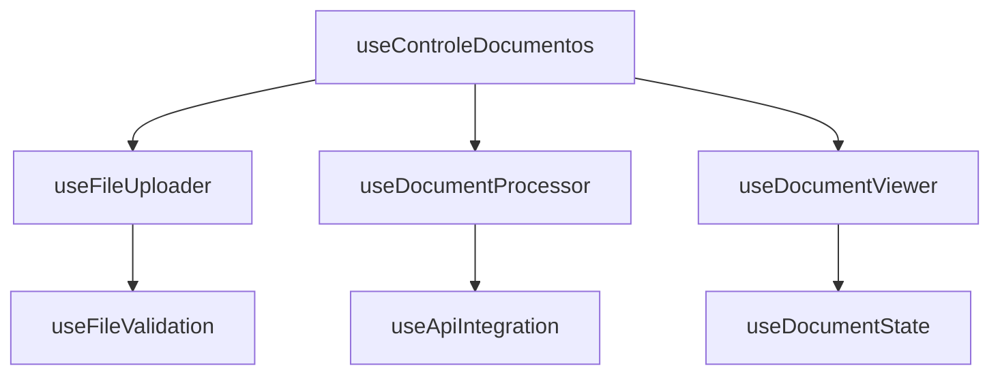
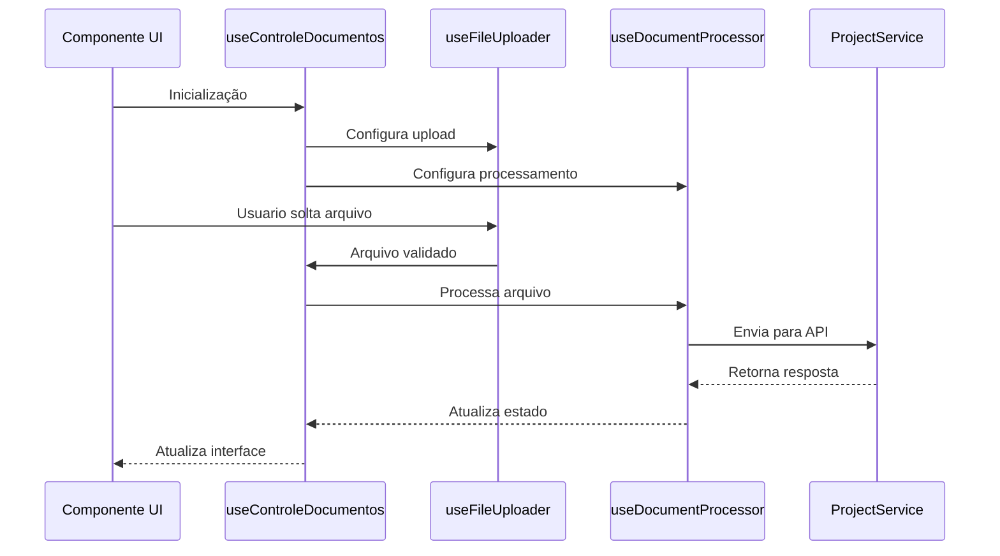

# Arquitetura Refatorada - useControleDocumentos

## Visão Geral da Nova Estrutura



[Mermaidchart](https://www.mermaidchart.com/play)


## 1. Hooks Especializados

### 1.1 useFileUploader
**Responsabilidades:**
- Gerenciamento de upload de arquivos
- Suporte a drag-and-drop
- Validação básica de arquivos

```typescript
interface UseFileUploaderProps {
  maxFileSize: number
  acceptedTypes: string[]
  onFileSelected: (file: File) => Promise<void>
}

function useFileUploader({
  maxFileSize,
  acceptedTypes,
  onFileSelected
}: UseFileUploaderProps) {
  // Implementação...
}
```

### 1.2 useDocumentProcessor
**Responsabilidades:**
- Processamento de documentos
- Conversão entre formatos
- Gerenciamento de metadados

```typescript
interface DocumentProcessorOptions {
  service: ProjectService
  onProgress?: (progress: number) => void
  onError?: (error: Error) => void
}

function useDocumentProcessor(options: DocumentProcessorOptions) {
  // Implementação...
}
```

### 1.3 useDocumentViewer
**Responsabilidades:**
- Controle de estado do visualizador
- Gerenciamento de documento ativo
- Navegação entre páginas

```typescript
interface UseDocumentViewerProps {
  initialDocument?: DocumentoUpload | null
  onClose?: () => void
}

function useDocumentViewer({
  initialDocument = null,
  onClose
}: UseDocumentViewerProps) {
  // Implementação...
}
```

## 2. Injeção de Dependências

### 2.1 Contexto de Serviços
```typescript
interface ServicesContextType {
  projectService: ProjectService
  // Outros serviços podem ser adicionados aqui
}

const ServicesContext = createContext<ServicesContextType | null>(null)

export function ServicesProvider({ children, services }: {
  children: ReactNode
  services: ServicesContextType
}) {
  return (
    <ServicesContext.Provider value={services}>
      {children}
    </ServicesContext.Provider>
  )
}
```

### 2.2 Hook de Serviços
```typescript
function useServices() {
  const context = useContext(ServicesContext)
  if (!context) {
    throw new Error('useServices must be used within a ServicesProvider')
  }
  return context
}
```

## 3. Funções Puras para Processamento

### 3.1 Validação de Arquivos
```typescript
interface FileValidationResult {
  isValid: boolean
  error?: string
}

function validateFile(
  file: File, 
  options: { maxSize: number; allowedTypes: string[] }
): FileValidationResult {
  // Implementação pura de validação
}
```

### 3.2 Conversão de Documentos
```typescript
interface DocumentConversionOptions {
  targetFormat: 'pdf' | 'html' | 'txt'
  quality?: number
}

async function convertDocument(
  file: File,
  options: DocumentConversionOptions
): Promise<File> {
  // Implementação pura de conversão
}
```

## 4. Estrutura de Diretórios Proposta

```
src/
  hooks/
    useControleDocumentos/
      index.ts                # Exporta o hook principal
      useFileUploader.ts      # Lógica de upload
      useDocumentProcessor.ts # Processamento de documentos
      useDocumentViewer.ts    # Visualização de documentos
      utils/
        fileValidation.ts     # Funções de validação
        documentConversion.ts # Funções de conversão
        errorHandling.ts      # Tratamento de erros
    services/
      projectService.ts       # Serviço de projeto
      documentService.ts      # Serviço de documentos
    contexts/
      ServicesContext.tsx     # Contexto de serviços
      DocumentContext.tsx     # Contexto de documentos
```

## 5. Fluxo de Dados da Nova Arquitetura


[Mermaidchart](https://www.mermaidchart.com/play)

## 6. Benefícios da Nova Estrutura

1. **Separação de Responsabilidades**
   - Cada hook tem uma única responsabilidade clara
   - Código mais fácil de testar e manter

2. **Injeção de Dependências**
   - Melhor testabilidade
   - Facilita a substituição de implementações

3. **Funções Puras**
   - Maior previsibilidade
   - Fácil de debugar
   - Melhor cobertura de testes

4. **Extensibilidade**
   - Fácil adição de novos formatos
   - Suporte a novos serviços sem modificar o código existente

## 7. Próximos Passos

1. Implementar os hooks especializados
2. Criar testes unitários para cada módulo
3. Migrar a lógica existente para a nova estrutura
4. Atualizar a documentação
5. Realizar testes de integração
